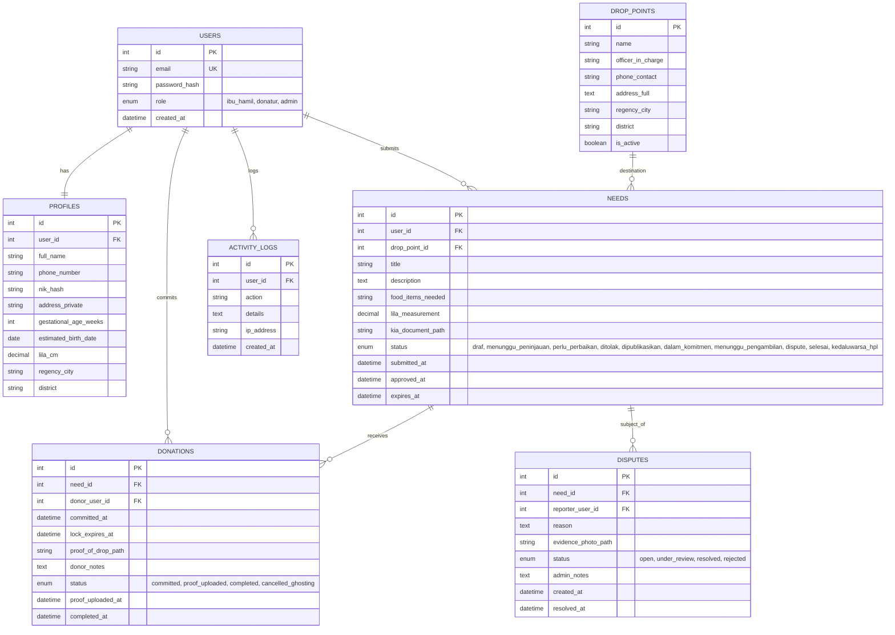

# DOKUMENTASI SKEMA DATABASE (nurtura_db)

Berikut adalah rancangan kamus data relasional untuk sistem Nurtura menggunakan engine MySQL (InnoDB).

```mermaid
erDiagram
    USERS ||--|| PROFILES : has
    USERS ||--o{ NEEDS : submits
    USERS ||--o{ DONATIONS : commits
    DROP_POINTS ||--o{ NEEDS : destination
    NEEDS ||--o{ DONATIONS : receives
    NEEDS ||--o{ DISPUTES : subject_of
    USERS ||--o{ ACTIVITY_LOGS : logs

    USERS {
        int id PK
        string email UK
        string password_hash
        enum role "ibu_hamil, donatur, admin"
        datetime created_at
    }

    PROFILES {
        int id PK
        int user_id FK
        string full_name
        string phone_number
        string nik_hash
        string address_private
        int gestational_age_weeks
        date estimated_birth_date
        decimal lila_cm
        string regency_city
        string district
    }

    DROP_POINTS {
        int id PK
        string name
        string officer_in_charge
        string phone_contact
        text address_full
        string regency_city
        string district
        boolean is_active
    }

    NEEDS {
        int id PK
        int user_id FK
        int drop_point_id FK
        string title
        text description
        string food_items_needed
        decimal lila_measurement
        string kia_document_path
        enum status "draf, menunggu_peninjauan, perlu_perbaikan, ditolak, dipublikasikan, dalam_komitmen, menunggu_pengambilan, dispute, selesai, kedaluwarsa_hpl"
        datetime submitted_at
        datetime approved_at
        datetime expires_at
    }

    DONATIONS {
        int id PK
        int need_id FK
        int donor_user_id FK
        datetime committed_at
        datetime lock_expires_at
        string proof_of_drop_path
        text donor_notes
        enum status "committed, proof_uploaded, completed, cancelled_ghosting"
        datetime proof_uploaded_at
        datetime completed_at
    }

    DISPUTES {
        int id PK
        int need_id FK
        int reporter_user_id FK
        text reason
        string evidence_photo_path
        enum status "open, under_review, resolved, rejected"
        text admin_notes
        datetime created_at
        datetime resolved_at
    }

    ACTIVITY_LOGS {
        int id PK
        int user_id FK
        string action
        text details
        string ip_address
        datetime created_at
    }
```
